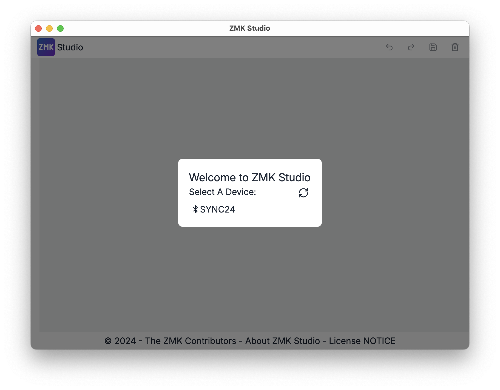
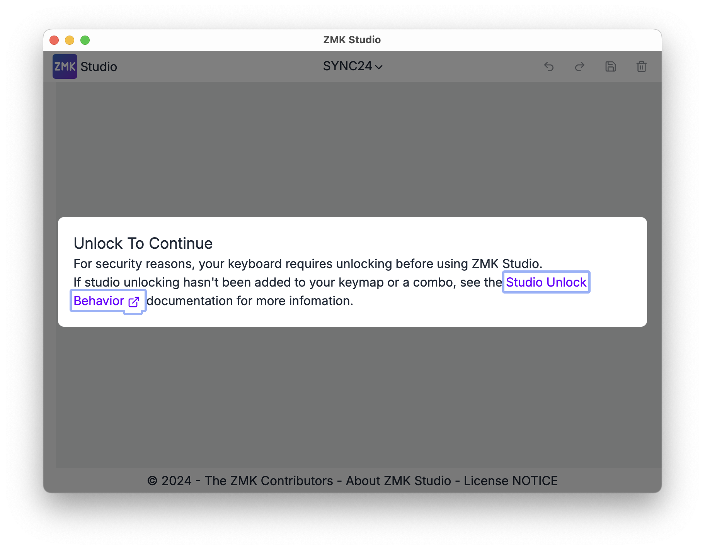
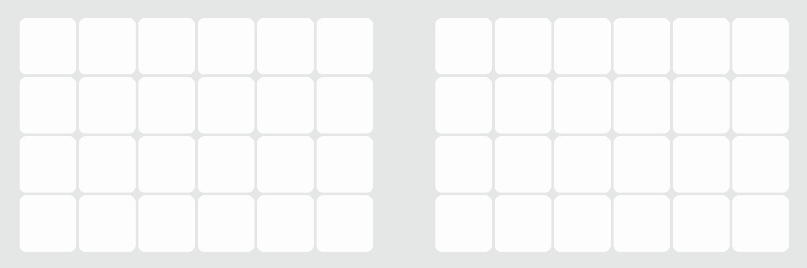
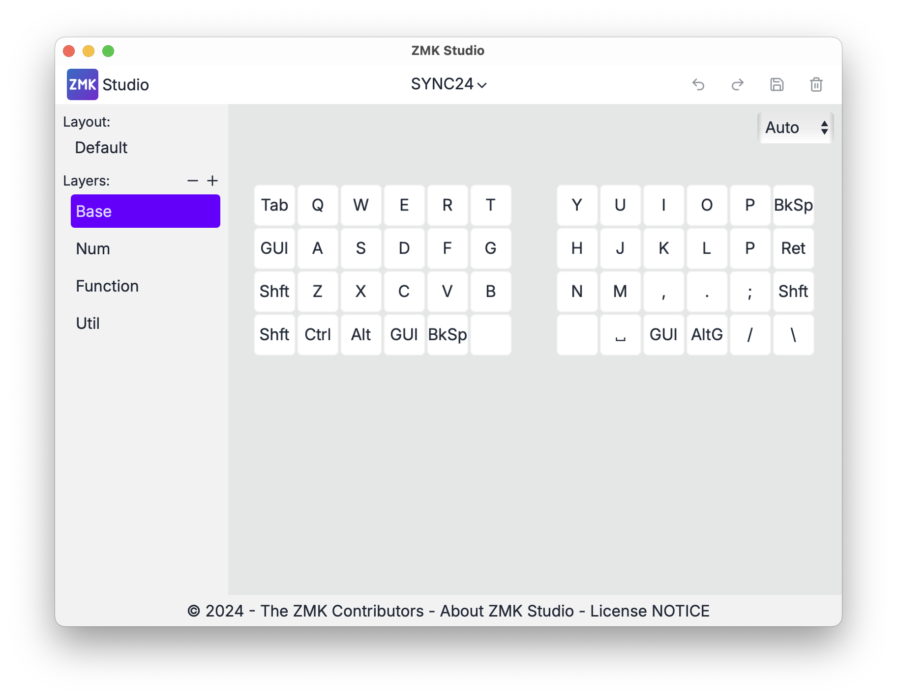

# SYNC24™

## 仕様

- **配列**: 左右分割・オーソリニア
- **筐体**: 3Dプリント製
- **キー数**: 48
- **キーピッチ**: 19mm
- **ホットスワップ対応**: Kailh Choc V1, V2
- **電源**: リチウムイオンポリマー電池 (3.7V / 110mAh)
- **底面マグネット**: MagSafe互換
- **ファームウェア**: ZMK firmware
- **設定ツール**: ZMK Studio

## 左右の見分け方  

リセットボタンが **黒い方が左**、**白い方が右** です。  
左右でハードウェア的な違いはありません。  

## ペアリング

- 電源を入れると **すぐにペアリング待ちの状態** になります。  
- 初回ペアリング時、 **BT_SEL 0 に登録** されます。  
- **BT_SEL 0 〜 BT_SEL 4 の計5台** まで登録可能です。  

## 充電について

**必ず電源スイッチをオンにした状態で充電してください**  
充電中は **緑色のランプ** が点灯します。  

## デフォルトのキーマップ

## レイヤー移動

- **tap** → Space  
  **hold** → Numレイヤーに移動  
  

- **tap** → Return  
  **hold** → Functionレイヤーに移動  
  

- **Combo**  
  

## ZMK Studio でのキーマップ変更

ZMK StudioにはWeb版とApp版があります。アプリだとbluetooth経由でキーマップの書き換えができるのでお勧めです。

- [web](https://zmk.studio) 
- [app](https://zmk.studio/download)

1. キーボードをbluetooth,もしくは有線で接続します。

2. ZMK Studioを起動し`SYNC24`を選択します。

3. `Unlock To Continue`を促された場合はキーマップを参考に解除してください。

4. 解除に成功すると自動的にキーマップ編集画面へと移動します。

## ファームウェア  

ビルド済みの ZMK firmware（`.uf2`） を **[firmware](./firmware)** フォルダに配置しています。  
購入時に書き込んであるものと同じです。

また、カスタマイズを行いたい場合は、**[zmk-config-sync24](https://github.com/renatoomany/zmk-config-sync24)** に設定ファイルを用意しています。  
必要に応じてフォークしてお使いください。  

⚠ **ご自身での変更・ビルド方法についての詳細なサポートは提供できませんので、ご了承ください。**  
必要に応じて [ZMK公式ドキュメント](https://zmk.dev/docs) をご参照ください。

---

### ファームウェア書き込み手順

1. **SYNC24 を UF2ブートローダー モードにする**

   - キーボードの上面にある **リセットボタンを2回連続で押す**  
     → `XIAO-SENSE` という名前の USB ドライブが表示されます

2. **ファームウェア（`.uf2`）をドラッグ＆ドロップ**

   - ダウンロードした `.uf2` ファイルを `XIAO-SENSE` ドライブにドラッグしてください
   - 転送が終わると、自動的に再起動し、ドライブが消えます

3. **完了**

---

## バッテリー仕様

SYNC24には **DATA POWER DTP401525** (3.7v / 110mAh)を使用しています。  

販売サイト
- [マルツ](https://www.marutsu.co.jp/pc/i/2228265)
- [千石電商](https://www.sengoku.co.jp/mod/sgk_cart/detail.php?code=EEHD-5VAC)  

> [!WARNING]
> 強い衝撃を与えたり、極端な高温・低温での使用は避けてください  
> 異常が生じた場合は、直ちに使用を中止してください  

## 連絡先

不具合や質問などありましたら、以下のメールアドレスにお問い合わせください。  

📧 [renatoomany@gmail.com](mailto:renatoomany@gmail.com)  